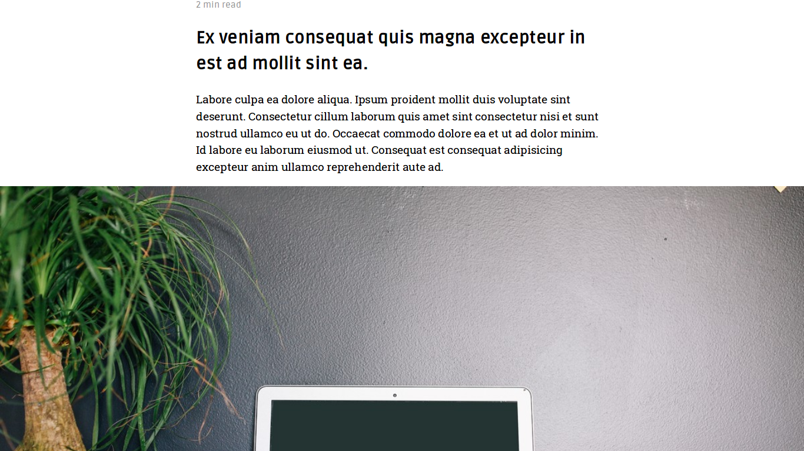
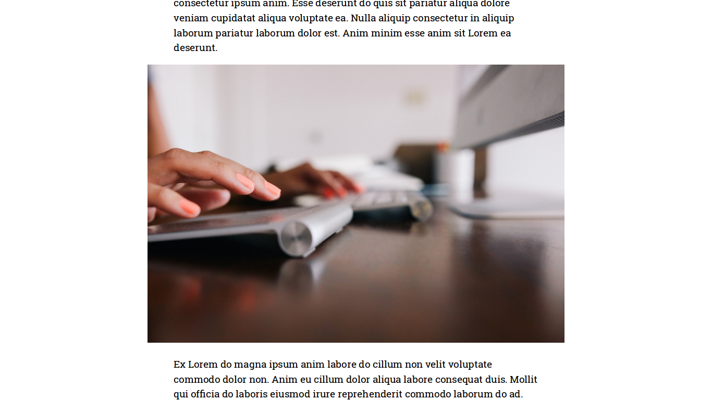
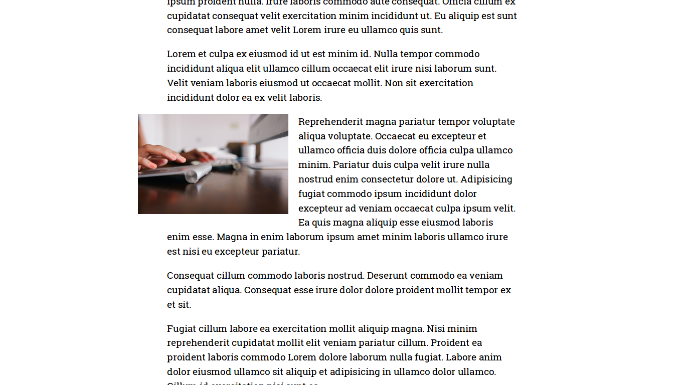
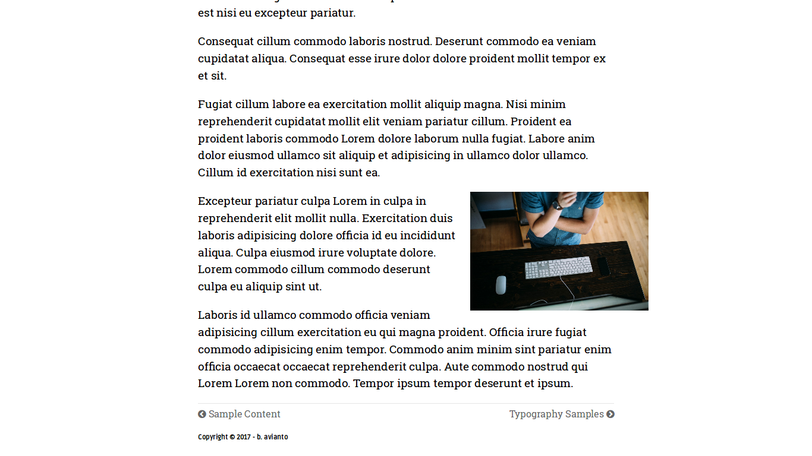

# Kiera Theme for Hugo

Kiera is the theme specialized for presenting writing layout like long essay or technical writing.

## Main Features

* 4 image placements with `figure` support using shortcodes.
* Excellent code highlight support thanks to Hugo Chroma. 
* Use Font Awesome for icons (Cloudflare CDN)
* Utilize normalize.css for consistent styling (Cloudflare CDN)
* Use Google Fonts: Ruda (serif) and Roboto Slab (sans-serif)
* Disqus comment loaded on demand

## Installation 

```console
cd themes
git clone ... kiera
```
Using `git submodule` is recommended instead of `git clone` as per recommendation from [Netlify](https://gohugo.io/hosting-and-deployment/hosting-on-netlify/#use-hugo-themes-with-netlify)

## Configuration

Optional `config.toml`:

```toml
pygmentsCodeFences = true

disqusShortname = ""
googleAnalytics = ""

[author]
    name = ""
    github = ""
    gitlab = ""
    linkedin = ""
    facebook = ""
    twitter = ""
    instagram = ""

[params]
    tagline = "the tagline for this website"

```

## Main Menu

Add regular non-posts related page (eq. About page) to main menu by adding these lines to the page front matter:

TOML:

```toml
menu = "main"
meta = "false"
```

YAML:

```yml
menu: "main"
meta: "false"
```

```meta``` refers to time, categories, tags and reading time which are not necessary for this kind of page.

## Categories & Tags

Both can be used, also can use only one of them or neither.

## Images

Kiera supports adding image as `img` tag with standard Markdown

``

or use 

``

to add it as `figure`

The basic placement is 100% width within content and scaled accordingly in smaller screen. Recommended width for image is 600 pixels minimum.

There are 4 other placements variation:

* ```#full``` or ```class="full"``` for full width

* ```#mid``` or ```class="mid"``` for middle

* ```#float``` or ```class="float"``` for float left

* ```#float-right``` or ```class="float-right"``` for float right


## Code Hightlight

Using fenced code with Chroma support.

## Font Awesome icons

For usage, refer to [Font Awesome](https://fontawesome.io).

## Disqus On Demand

Disqus comments are loaded on demand, by clicking <kbd>View Comments</kbd> button.

## Support and Pull Requests

Please use GitHub issues to file bugs. If you can help fixing bugs, optimize the theme or adding features, please do pull requests, I really love to see what others can come up with.


