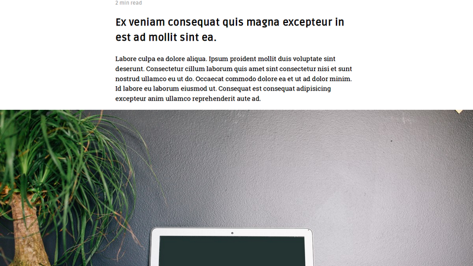

# Kiera Theme for Hugo

Kiera is the theme specialized in presenting writing layout like long essay or technical writing.

It was originally developed by [b. avianto](https://github.com/avianto/hugo-kiera) and now maintained by [funkydan2](//github.com/funkydan2/)


- [Kiera Theme for Hugo](#kiera-theme-for-hugo)
  - [Main Features](#main-features)
  - [Demo](#demo)
  - [Installation](#installation)
  - [Update the theme](#update-the-theme)
    - [git submodule method](#git-submodule-method)
    - [independent directory method](#independent-directory-method)
  - [Configuration](#configuration)
    - [Main Menu](#main-menu)
    - [Categories & Tags](#categories--tags)
    - [Images](#images)
    - [Code highlight](#code-highlight)
    - [Font Awesome icons](#font-awesome-icons)
    - [Disqus on demand](#disqus-on-demand)
  - [Support and Pull Requests](#support-and-pull-requests)

## Main Features
- Simple, 'no-nonsense' styling.
- 4 image placements with `figure` support using shortcodes.
- (Optional) Feature images for posts and twiter cards.
- Excellent code highlight support thanks to Hugo Chroma.
- Use Font Awesome for icons.
- Utilize normalize.css for consistent styling (Cloudflare CDN).
- Use Google Fonts: Ruda (serif) and Roboto Slab (sans-serif).
- [Disqus](https://disqus.com) or [Utterances](https://utteranc.es) comments loaded on demand.


## Demo

Live demo: [https://themes.gohugo.io/theme/hugo-kiera/](https://themes.gohugo.io/theme/hugo-kiera/)

## Installation

Change into Hugo directory then:

```console
$ cd themes
$ git clone https://github.com/funkydan2/hugo-kiera.git hugo-kiera
```

More detailed instruction at [Hugo Docs](https://gohugo.io/getting-started/).

Using `git submodule` is recommended instead of `git clone` as per recommendation from [Netlify](https://gohugo.io/hosting-and-deployment/hosting-on-netlify/#use-hugo-themes-with-netlify).

```console
$ cd /path/to/the/root/of/your/project/themes
$ git submodule add https://github.com/funkydan2/hugo-kiera.git
```

## Update the theme

### git submodule method

Use `git` to merge latest commits into your project by running:

```bash
$ cd /path/to/the/root/of/your/project/
$ git submodule update --rebase --remote
```

### independent directory method

Delete the directory corresponding to the theme and download the latest version of the theme by cloning the repo:

```bash
$ cd /path/to/the/root/of/your/project/
$ rm -rf themes/hugo-kiera/
$ git clone https://github.com/funkydan2/hugo-kiera.git themes/hugo-kiera/
```

## Configuration

For reference look inside folder `exampleSite` for content example and `config.toml`.

*Important*: don't delete or move `archetypes` folder from root unless it is necessary. Current Hugo priority lookup will look into this folder first before any other `archetypes` folder and could cause problem.

Recommended optional `config.toml`:

```toml
pygmentsCodeFences = true

disqusShortname = "" #Disqus shortname
googleAnalytics = "" #Google Analytics ID

[author]
    name = ""           #Author name
    github = ""         #Github username
    gitlab = ""         #Gitlab username
    linkedin = ""       #LinkedIn username
    facebook = ""       #Facebook username
    twitter = ""        #Twitter username
    instagram = ""      #Instagram username
    stackoverflow = ""  #StackOverflow username

[params]
    tagline = "the tagline for this website"
    customCSS = []  #Optional Customised CSS
```

### Main Menu

To add non-posts related page (eq. About page) to the main menu, adding these lines to the page [front matter](https://gohugo.io/content-management/front-matter/):

TOML:

```toml
menu = "main"
meta = "false"
```

YAML:

```yml
menu: "main"
meta: "false"
```

`meta` refers to time, categories, tags and reading time which are not necessary for this kind of page.

For posts listing page, add `_index.md` file inside `content\posts` folder with these front matter:

TOML:

```toml
title = "Posts"
menu = "main"
weight = "10"
```


YAML:

```yml
title : "Posts"
menu : "main"
weight : "10"
```

### Categories & Tags

Pages can include both, either, or neither *Categories* or *Tags*.
To link to tags use the url `/tags/` (e.g. `https://example.com/tags/`) and `/categories/` for categories.

### Images

Kiera supports adding image as `img` tag with standard Markdown:

``

to wrap it with `figure` use:

``

The basic placement is 100% width within content and scaled accordingly in smaller screen. Recommended width for image is 600 pixels minimum.

Kiera supports different placement by adding:

- For `img`, use ``
- For `figure`, use ``

There are 4 configured placements

- `#full` or `class="full"` for full width.

- `#mid` or `class="mid"` for middle:

- `#float` or `class="float"` for float left:

- `#float-right` or `class="float-right"` for float right:


### Code highlight

Using fenced code with Chroma support.

### Font Awesome icons

For usage, refer to [Font Awesome](https://fontawesome.com/).

### Disqus on demand

[Disqus](https://disqus.com/) comments are loaded on demand, by clicking the <kbd>View Comments</kbd> button.

## Support and Pull Requests

Please use GitHub issues to file bugs. If you can help fixing bugs, optimize the theme or adding features, please do pull requests, I really love to see what others can come up with.
